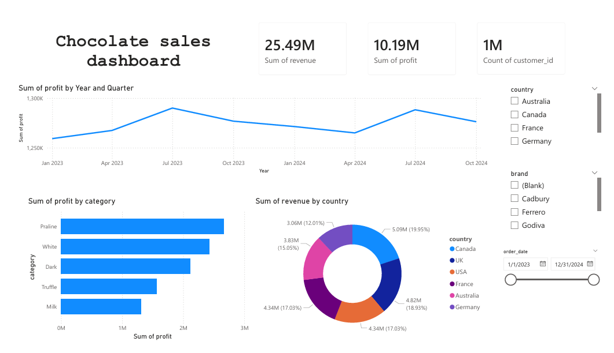
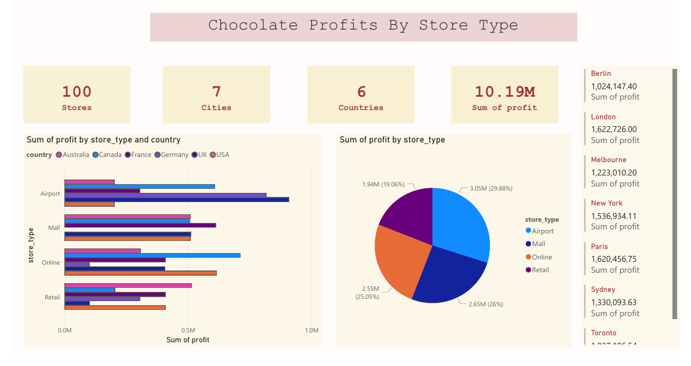

# Chocolate Profit Analysis: Regional Performance Dashboard

## Executive Summary
This project analyzes a global chocolate retail operation spanning **6 countries** and **100 stores**. By integrating disparate datasets, this dashboard identifies key seasonal trends and channel efficiencies to optimize a **$25.49M revenue** stream.

| Metric | Value |
| :--- | :--- |
| **Total Revenue** | $25.49M |
| **Total Profit** | $10.19M |
| **Total Customers** | 1.0M |
| **Global Footprint** | 7 Cities across 6 Countries |

---

## 📈 Core Business Findings

### 1. Seasonal Periodicity (The "Q3 Spike")

* **Trend:** Profitability consistently reaches its annual peak in **July (Q3)**.
* **Uniformity:** This pattern is statistically consistent across 2023 and 2024.
* **Insight:** The business experiences a universal demand surge in Q3 that precedes traditional Q4 holiday cycles, regardless of the brand or region.

### 2. Product & Market Hierarchy
* **Top Categories:** **Praline** is the primary profit driver globally, followed by **White Chocolate**. 
* **Market Leaders:** The **UK** and **USA** are the strongest markets, contributing **19.95% ($5.09M)** and **18.93% ($4.82M)** of total revenue, respectively.
* **Regional Consistency:** The preference for Praline remains the dominant trend across all analyzed countries.

### 3. Operational Channel Efficiency

* **High-Performing Hubs:** **Airport locations** are the most profitable channel, accounting for **29.88% ($3.05M)** of total profit.
* **City Performance:** **London** and **Paris** are the top-performing cities, each generating approximately **$1.62M** in profit.
* **Digital vs. Physical:** Online sales and Mall locations perform nearly identically, each contributing roughly **25-26%** of total profit.

---

## 🚀 Strategic Recommendations

### 1. Optimize Marketing Spend for Q3
Since profits spike in **July**, the marketing budget should be "front-loaded." Shift **40% of the annual promotional budget** to May and June to capture the maximum audience before the peak Q3 window begins.

### 2. Expand the "Airport-First" Retail Model
Airport stores generate the highest profit density. Future physical expansion should prioritize international transit hubs in high-revenue regions like the **UK** and **Germany** rather than traditional street-level retail.

### 3. Premium Inventory Pivot
With **Praline** and **White Chocolate** driving the bulk of profits, the supply chain should prioritize these categories. Consider reducing the inventory of lower-performing categories like **Milk chocolate** to free up capital for premium, high-margin product development.

---

## 🛠️ Technical Architecture

### Data Modeling & ETL
The analysis utilizes a **Star Schema** to maintain high performance and filter integrity:
* **Fact Table:** Sales (metrics, keys, dates).
* **Dimension Tables:** Products, Customers, and Stores.
* **Power Query:** Standardized the `Store` table by resolving header alignment issues and validating data types across all CSV sources.

### Version Control
* **Format:** Saved as a **Power BI Project (.pbip)** for transparent, folder-based metadata tracking.
* **Deployment:** Managed via local **Git** and pushed to **GitHub** to facilitate collaborative development and version history.

---

## How to View
1.  **Clone:** `git clone <your-repo-url>`
2.  **Open:** Launch the `.pbip` file in **Power BI Desktop**.
3.  **Data Refresh:** Ensure all CSV source files remain in the project directory to maintain connection strings.
